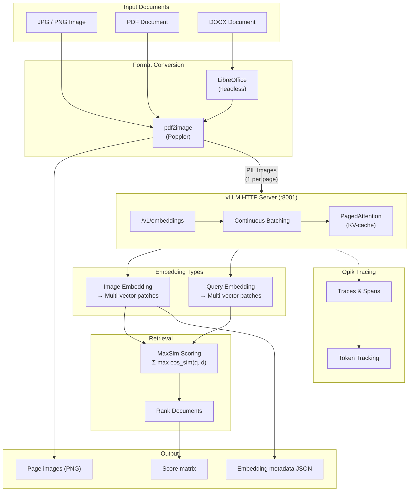
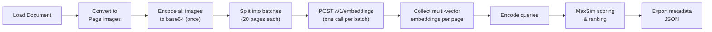
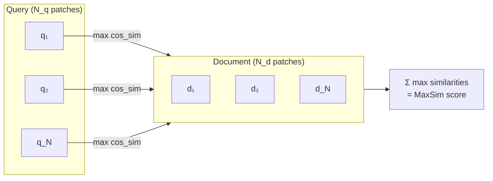
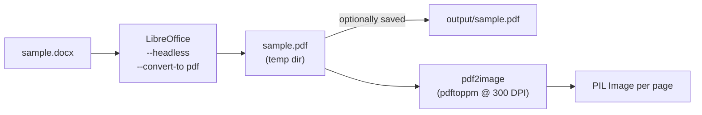
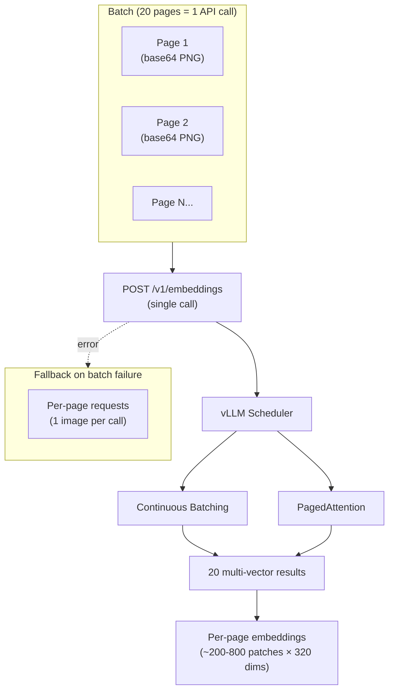
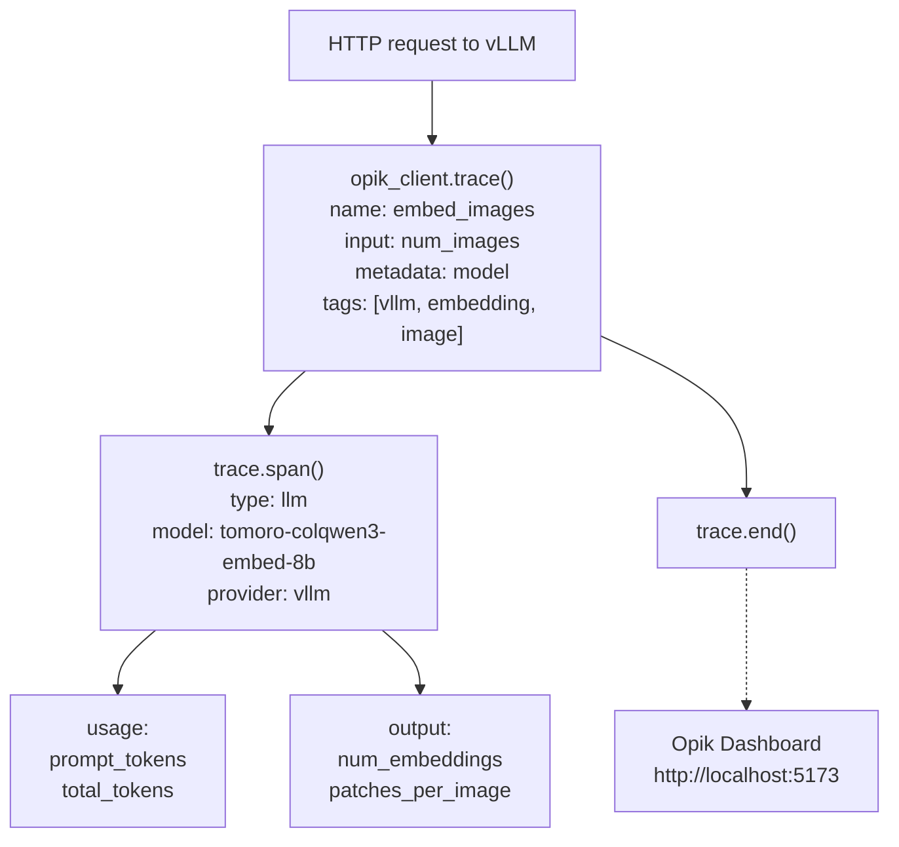

# ColQwen3 Multi-Vector Embeddings Notebook

Document embedding using **ColQwen3** (TomoroAI/tomoro-colqwen3-embed-8b) with two backend options: a **vLLM HTTP server** (`/pooling` API) or **vLLM Offline** (direct in-process inference via `vllm.LLM`). Produces multi-vector ColPali-style patch embeddings for images, PDFs, and DOCX files with **MaxSim** scoring for retrieval — all traced with **Opik** observability.

Designed to run on [RunPod](https://www.runpod.io/) GPU pods. The vLLM server backend mirrors the production architecture in `vision-rag/docker-compose.yml` where ColPali runs as a standalone container. The vLLM offline backend is useful for simpler single-process setups without running a separate server.

## High-Level Architecture



## Processing Pipeline



## How ColPali Multi-Vector Embeddings Work

Unlike traditional dense embeddings (one vector per document), ColPali produces a **list of patch vectors** per image or query. Each patch corresponds to a visual or textual token region.

Retrieval uses **MaxSim** (Maximum Similarity) scoring:

```
MaxSim(Q, D) = Σ_{q ∈ Q} max_{d ∈ D} cos_sim(q, d)
```

For each query patch vector, find its maximum cosine similarity against all document patch vectors, then sum these maxima. This late-interaction approach captures fine-grained visual-textual alignment without requiring a cross-encoder at query time.



## Backend Options

The notebook supports two embedding backends. Set `BACKEND` in the toggle cell:

| Backend                        | `BACKEND =` | Requirements                     | Best For                                  |
|--------------------------------|-------------|----------------------------------|-------------------------------------------|
| **vLLM HTTP Server** (default) | `"vllm"`    | Running vLLM server on port 8001 | Production mirroring, high throughput     |
| **vLLM Offline**               | `"offline"` | `vllm` (same package as server)  | No server process needed, development use |

Both backends produce **identical output formats** (`list[list[float]]` per page/query), so all downstream cells (MaxSim scoring, score matrix, export) work unchanged.

### When to use the offline backend

- You want simpler single-process setup without running a separate server
- Quick experimentation and development
- Don't need multi-GPU tensor parallelism or multi-process request queuing

### When to use the vLLM server backend (default)

- Production deployment mirroring the `vision-rag/docker-compose.yml` architecture
- High-throughput batch embedding (vLLM's PagedAttention + continuous batching)
- Running multiple concurrent embedding requests

## DOCX Conversion Path



## Batched Embedding Strategy

Pages are split into sub-batches (default 20) to stay within vLLM's KV-cache limits. Each sub-batch is a single `/v1/embeddings` call. If a batch fails, the function falls back to per-page requests.



## Embedding Dimensions

| Metric | Typical Value |
|--------|---------------|
| Embedding dimension | 320 |
| Patches per page (300 DPI) | 200–800 |
| Memory per page | ~250–625 KB |
| Query patches | ~10–30 |

## Backend Comparison

| Aspect           | vLLM Offline (`BACKEND = "offline"`)       | vLLM Server (`BACKEND = "vllm"`, default)  |
|------------------|--------------------------------------------|--------------------------------------------|
| Model loading    | `vllm.LLM(task="embed")` in notebook       | External `vllm serve` process              |
| API              | `llm.encode()` Python calls (in-process)   | vLLM `/pooling` REST API over HTTP         |
| Batch processing | vLLM internal scheduler (automatic)        | vLLM continuous batching + PagedAttention  |
| Input format     | PIL Images directly                        | Base64-encoded data URIs in JSON           |
| Scaling          | Single GPU, single process                 | Horizontal across GPUs/nodes               |
| Batching         | Automatic (vLLM decides internally)        | Concurrent HTTP via ThreadPoolExecutor     |
| Use case         | Development, no server setup needed        | Production, high throughput                |

## Opik Observability Integration

Both backends use manual Opik spans (auto-instrumentation is unavailable since vLLM runs either as an HTTP server or as an in-process engine). Spans are created for each embedding request via `opik_client.trace()` / `trace.span()`.



## Model Selection Guide

| Model ID | Precision | VRAM (approx) | Embedding Dim | Best For |
|----------|-----------|---------------|---------------|----------|
| `TomoroAI/tomoro-colqwen3-embed-8b` | BF16 | ~18 GB | 320 | **This notebook** — full precision, best embedding quality |
| `TomoroAI/tomoro-ai-colqwen3-embed-8b-awq` | AWQ 4-bit | ~8 GB | 320 | Production — smaller footprint, shares GPU with other models |

> **Why full precision for this notebook?** On RunPod you typically have a dedicated GPU with ample VRAM. The non-AWQ BF16 model avoids quantization artifacts in embeddings, which matters for retrieval quality. The AWQ variant is used in the production `docker-compose.yml` where three models (ColPali + Qwen3-VL + Qwen2.5-7B) share a single A100 80GB GPU.

## Output Folder Structure

```
embedding_output/
    <image_stem>/
        <image_stem>.png                    # copy of original image
        <image_stem>_embedding_meta.json    # embedding metadata

    <pdf_stem>/
        page_001.png                        # rasterized page images
        page_002.png
        <pdf_stem>_embedding_meta.json      # per-page embedding metadata

    <docx_stem>/
        <docx_stem>.pdf                     # intermediate PDF from LibreOffice
        page_001.png
        page_002.png
        <docx_stem>_embedding_meta.json     # per-page embedding metadata
```

## Quick Start

1. **Create a RunPod pod** with a PyTorch 2.8.0 template and an appropriate GPU.

   | Model | Precision | Min VRAM | Recommended GPU | Price |
   |-------|-----------|----------|-----------------|-------|
   | **tomoro-colqwen3-embed-8b** | BF16 | ~18 GB | RTX A5000 (24 GB) | ~$0.16/hr |
   | **tomoro-colqwen3-embed-8b** | BF16 | ~18 GB | RTX A6000 (48 GB) | ~$0.33/hr |
   | **tomoro-ai-colqwen3-embed-8b-awq** | AWQ 4-bit | ~8 GB | RTX 4090 (24 GB) | ~$0.34/hr |

2. **Install system dependencies** (run once):
   ```bash
   apt-get update -qq && apt-get install -y -qq poppler-utils libreoffice libgl1 libglib2.0-0
   ```

3. **Install Python packages**:
   ```bash
   pip install "vllm>=0.16.0" "httpx>=0.27.0" "Pillow>=10.4.0,<13.0" \
       "pdf2image==1.17.0" "numpy>=1.26.0" "tqdm>=4.66.0" "ipywidgets>=8.1.0" \
       "hf_transfer" "opik"
   ```

4. **Start the vLLM server**:
   ```bash
   vllm serve TomoroAI/tomoro-colqwen3-embed-8b \
       --port 8001 \
       --task embed \
       --trust-remote-code \
       --dtype bfloat16 \
       --max-model-len 32768 \
       --gpu-memory-utilization 0.95
   ```

5. **Configure Opik** (optional, for tracing):
   ```bash
   git clone https://github.com/comet-ml/opik.git && cd opik
   docker compose --profile opik up -d
   # UI at http://localhost:5173
   ```

6. **Open the notebook**, point `IMAGE_PATH` / `PDF_PATH` / `DOCX_PATH` to your files, configure `QUERIES`, and run all cells.

### Quick Start (vLLM Offline Backend)

1. **Create a RunPod pod** (same GPU requirements as above).

2. **Install system and Python dependencies** (same as above — vLLM covers both backends).

3. **No server needed** — the model loads in-process via `vllm.LLM`.

4. **Run the vLLM offline model loading cell** (loads ~18 GB into VRAM).

5. **Set `BACKEND = "offline"`** in the backend toggle cell.

6. **Open the notebook**, configure file paths and queries, run all cells.

## Key Configuration

| Variable | Default | Description |
|----------|---------|-------------|
| `VLLM_BASE_URL` | `http://localhost:8001` | vLLM server address |
| `MODEL_ID` | `TomoroAI/tomoro-colqwen3-embed-8b` | Model ID (from HuggingFace Hub) |
| `REQUEST_TIMEOUT` | `120.0` | Seconds per HTTP request |
| `DTYPE` | `bfloat16` | Model precision |
| `MAX_MODEL_LEN` | `32768` | Max context length (tokens) |
| `GPU_MEMORY_UTILIZATION` | `0.95` | Fraction of VRAM to use |
| `EMBEDDING_DIM` | `320` | ColQwen3 patch embedding dimension |
| `PDF_DPI` | `300` | PDF rasterization resolution |
| `MAX_WORKERS` | `8` | Concurrent HTTP requests (vLLM server backend) |
| `BACKEND` | `"vllm"` | Embedding backend: `"vllm"` or `"offline"` |

## Notebook Sections

| Section | Description |
|---------|-------------|
| **Embed a Single Image** | Load any JPG/PNG and generate multi-vector patch embeddings |
| **Embed a PDF Document** | Rasterize all pages, batch-embed with sub-batching and fallback |
| **Embed a DOCX Document** | Convert via LibreOffice, rasterize, batch-embed |
| **Query Embedding** | Encode text queries into the same 320-dim multi-vector space |
| **MaxSim Scoring** | Rank all documents against queries using late-interaction retrieval |
| **Score Matrix** | Color-coded HTML table showing query-document relevance |
| **Backend Selection** | Toggle between vLLM Server and vLLM Offline backends |
| **Results Export** | Save embedding metadata (shapes, norms, patch counts) to JSON |
