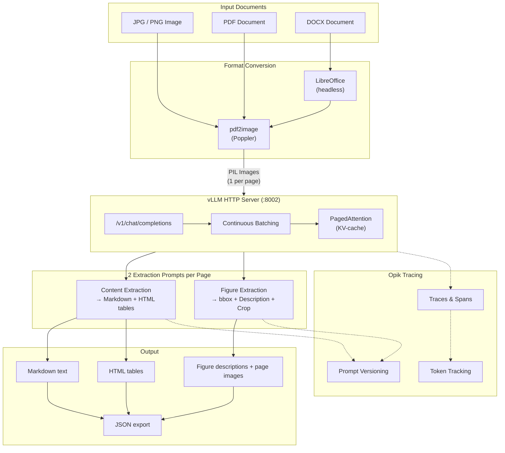
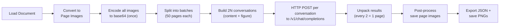
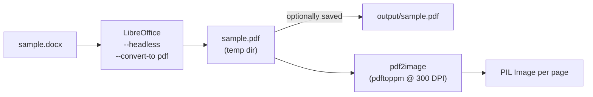
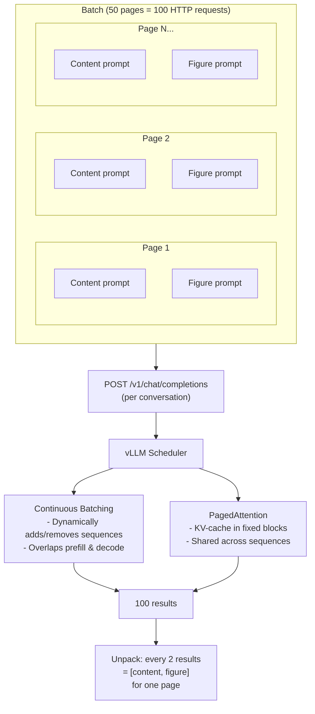
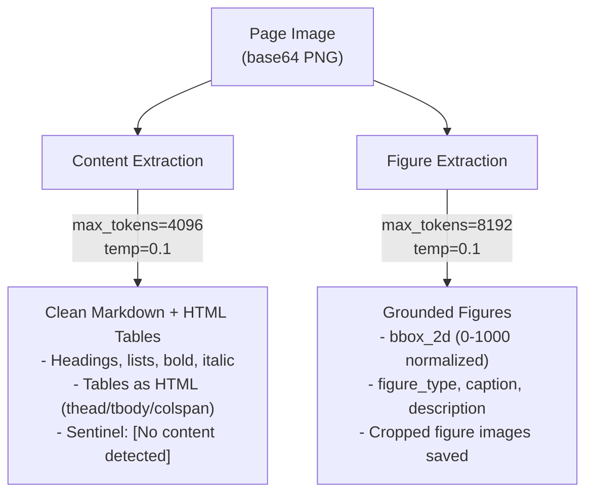
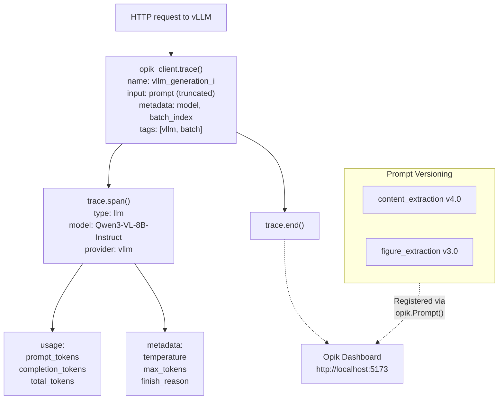
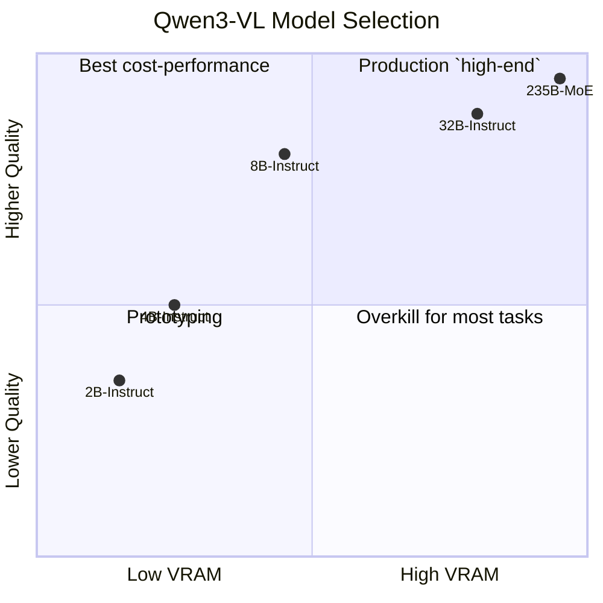

# Qwen3-VL Document Extraction Notebook

Structured document extraction using **Qwen3-VL-8B-Instruct** served via a **vLLM HTTP server** (`/v1/chat/completions` API). Extracts text, tables, and figures from images, PDFs, and DOCX files — all traced with **Opik** observability.

Designed to run on [RunPod](https://www.runpod.io/) GPU pods. Mirrors the production architecture in `vision-rag/docker-compose.yml` where Qwen3-VL runs as a standalone container.

## High-Level Architecture



## Processing Pipeline



## DOCX Conversion Path



## Batched Inference Strategy

Each page generates 2 conversations (content + figure). These are submitted as individual HTTP requests to the vLLM server, which handles concurrency via its internal scheduler.



## Per-Page Extraction Detail



## Opik Observability Integration

Since vLLM runs as an HTTP server, auto-instrumentation is unavailable. Manual spans are created for each generation via `opik_client.trace()` / `trace.span()`.



## vLLM Server vs Offline Inference

| Aspect | Offline (`vllm.LLM`) | vLLM Server (this notebook) |
|--------|----------------------|-----------------------------|
| Model loading | `vllm.LLM()` in-process | vLLM server handles it |
| API | Direct Python calls | OpenAI-compatible REST API |
| Batch processing | `llm.chat()` with list | vLLM continuous batching + PagedAttention |
| Input format | Python dicts | JSON over HTTP |
| Scaling | Single GPU, single process | Horizontal across GPUs/nodes |
| Use case | Development, experimentation | Production, high throughput |

## Model Selection Guide



| Model | VRAM (BF16) | DocVQA | OCRBench | Best For |
|-------|-------------|--------|----------|----------|
| **2B-Instruct** | ~5 GB | ~88% | ~780 | Prototyping, validation |
| **4B-Instruct** | ~10 GB | ~92% | ~840 | Consumer GPUs (RTX 3060) |
| **8B-Instruct** | ~18 GB | ~96% | 896 | **Production sweet spot** |
| **32B-Instruct** | ~64 GB | ~97% | 910 | High quality, needs A100 |
| **235B-A22B (MoE)** | multi-GPU | 97%+ | 920+ | State-of-the-art |

## Output Folder Structure

```
extraction_output/
    <image_stem>/
        page_001.png                  # copy of original image
        <image_stem>_extraction.json  # JSON export

    <pdf_stem>/
        page_001.png                  # rasterized page images
        page_002.png
        <pdf_stem>_extraction.json

    <docx_stem>/
        <docx_stem>.pdf               # intermediate PDF (preserved)
        page_001.png
        page_002.png
        page18_fig1_crop.png          # cropped figure images (per detected figure)
        page19_fig1_crop.png
        <docx_stem>_extraction.json
```

> **Figure crops**: When the figure extraction prompt detects figures with `bbox_2d` coordinates, the notebook crops each figure from the source page image and saves it as `page{N}_fig{M}_crop.png`. These are referenced in the `figures` array of the corresponding page entry in the extraction JSON.

## Quick Start

1. **Create a RunPod pod** with a PyTorch 2.8.0 template and an appropriate GPU (see model table above).

2. **Install system dependencies** (run once):
   ```bash
   apt-get update -qq && apt-get install -y -qq poppler-utils libreoffice libgl1 libglib2.0-0
   ```

3. **Install Python packages**:
   ```bash
   pip install "vllm>=0.16.0" "httpx>=0.27.0" "Pillow>=10.4.0,<13.0" \
       "pdf2image==1.17.0" "tqdm>=4.66.0" "ipywidgets>=8.1.0" "hf_transfer" "opik"
   ```

4. **Start the vLLM server**:
   ```bash
   vllm serve Qwen/Qwen3-VL-8B-Instruct \
       --port 8002 \
       --task generate \
       --trust-remote-code \
       --dtype bfloat16 \
       --max-model-len 16384 \
       --gpu-memory-utilization 0.95 \
       --limit-mm-per-prompt image=10
   ```

5. **Configure Opik** (optional, for tracing):
   ```bash
   git clone https://github.com/comet-ml/opik.git && cd opik
   docker compose --profile opik up -d
   # UI at http://localhost:5173
   ```

6. **Open the notebook**, point `IMAGE_PATH` / `PDF_PATH` / `DOCX_PATH` to your files, and run all cells.

## Key Configuration

| Variable | Default | Description |
|----------|---------|-------------|
| `VLLM_BASE_URL` | `http://localhost:8002` | vLLM server address |
| `MODEL_ID` | `Qwen/Qwen3-VL-8B-Instruct` | HuggingFace model ID |
| `REQUEST_TIMEOUT` | `120.0` | Seconds per HTTP request |
| `DTYPE` | `bfloat16` | Model precision |
| `MAX_MODEL_LEN` | `16384` | Max context length (tokens) |
| `GPU_MEMORY_UTILIZATION` | `0.95` | Fraction of VRAM to use |
| `MAX_NEW_TOKENS` | `4096` | Max output tokens (text/table) |
| `FIGURE_MAX_TOKENS` | `8192` | Max output tokens (figures) |
| `TEMPERATURE` | `0.1` | Low = deterministic extraction |
| `PDF_DPI` | `300` | PDF rasterization resolution |
| `BATCH_SIZE` | `50` | Pages per batch (limits KV-cache) |
